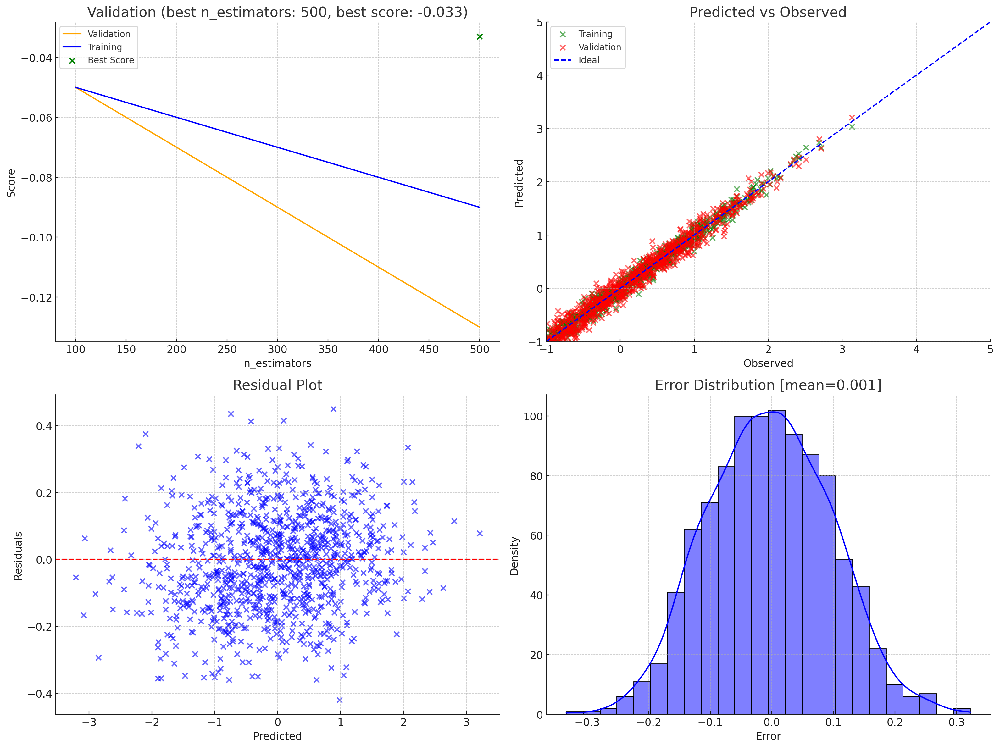
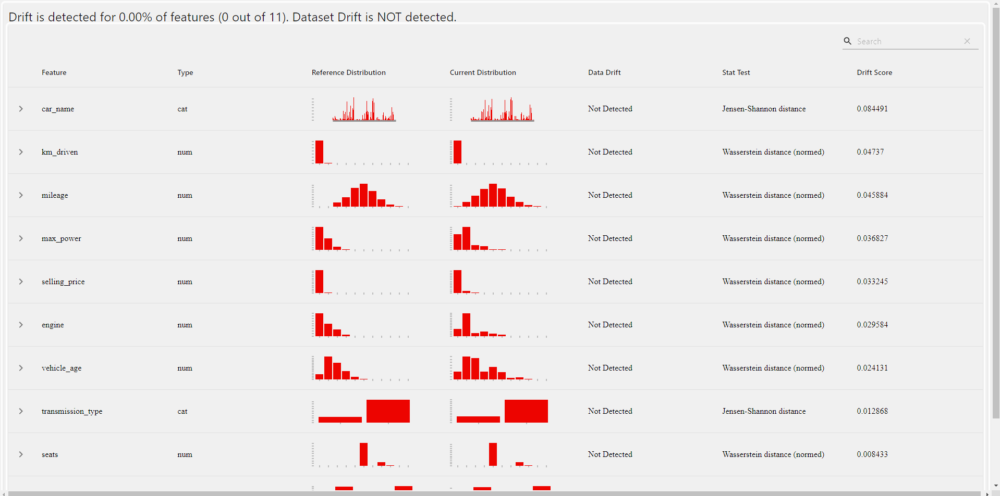

# Used-Car-Price-Prediction-Using-Deep-Learning

This project addresses the challenge of predicting the price of a used car by utilizing supervised machine learning techniques and deep learning methods. It focuses on a regression problem using a dataset of used car sales from the Indian car market (sourced from the Cardekho website). The aim is to build robust models that can accurately predict the price of a used car based on its attributes.


---

## Data Preprocessing and Visualization

The first step in the project is data preprocessing:
- **Handling Missing Values**: Missing data is imputed or removed to ensure clean and complete datasets.
- **Encoding Categorical Variables**: Categorical features are converted into numerical representations for seamless processing by machine learning and deep learning models.

To gain deeper insights into the data, **seaborn** is used for visualization:
- **Correlation Analysis**: Visualizations are created to understand the relationships between car attributes and sale prices, helping identify influential factors.

---

## Machine Learning Approach

### Models Explored
Several machine learning regression models provided by Scikit-learn were implemented and evaluated:
- **Linear Regression**
- **Lasso Regression**
- **Ridge Regression**
- **K-Neighbors Regressor**
- **Decision Tree**
- **Random Forest Regressor**
- **XGBRegressor**
- **CatBoost Regressor**
- **AdaBoost Regressor**

### Model Selection
After evaluating model performances, **XGBRegressor** and **Random Forest Regressor** emerged as the top-performing models. These were fine-tuned using **GridSearchCV** to optimize their hyperparameters.

---

## Deep Learning Approach

### Model Architecture
A deep learning model was built using **TensorFlow/Keras**:
- **Sequential Model**: Consists of multiple **Dense layers** with appropriate activation functions.
- **Output Layer**: Utilizes a **linear activation function** to predict continuous sale prices.

### Model Compilation
The model was compiled with the following:
- **Optimizer**: Ensures efficient model training.
- **Loss Function**: Mean Squared Error (MSE) is used for error minimization.
- **Evaluation Metric**: Mean Absolute Error (MAE) is used to monitor training progress.

### Training and Evaluation
- **Monitoring**: The training process is closely observed for signs of overfitting or underfitting.
- **Testing Performance**: The model is evaluated on testing data using the **R² score** as a performance metric.

---

## Combined Methodology

By leveraging both machine learning and deep learning approaches, this project provides a comprehensive framework for predicting used car prices:
1. Data is preprocessed and visualized for insights.
2. Machine learning models are evaluated to identify high-performing algorithms.
3. A deep learning model is built for additional predictive power.

Together, these methods ensure accurate and reliable predictions, enabling practical applications in the used car market.


**Install Dependencies**
* Install all required packages:
``` 
pip install -r requirements.txt

```


**Run the Application**

``` 
python app.py


```

## Pipeline Configuration

The project follows a pipeline-based approach with the following components:

### 1. **GridSearchCV**
Used for hyperparameter optimization to enhance model performance.

### 2. **Configurable Setup**
Modifications can be made through the `/update_model_config` route in the Flask application.

### 3. **Key Folders**
#### **`carprice`**
This is the main package containing:
- **`Artifact`**: Stores all outputs (artifacts) generated during the application's execution.
- **`Components`**: Contains the core modules of the machine learning workflow:
  - **`DataIngestion`**: Responsible for loading and splitting the dataset.
  - **`DataValidation`**: Ensures the quality and integrity of the data.
  - **`DataTransformation`**: Handles preprocessing and feature engineering.
  - **`ModelTrainer`**: Trains the machine learning models.
  - **`ModelEvaluation`**: Compares model performance to determine the best fit.
  - **`ModelPusher`**: Deploys the trained model for production use.


## Validation Result ##



When you Train the model everytime with new data, user can check the data drift in data validation artifact 

